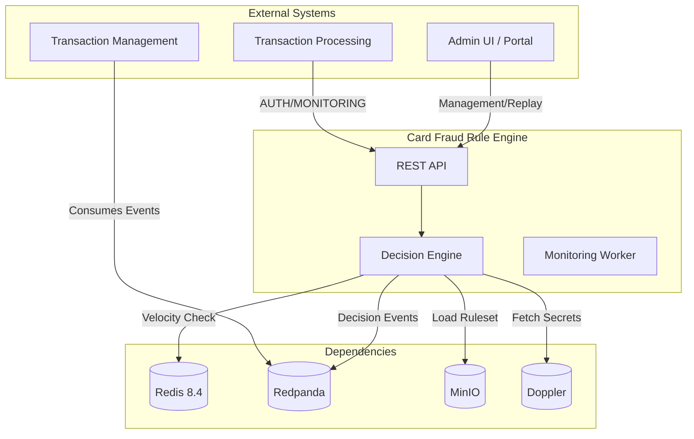
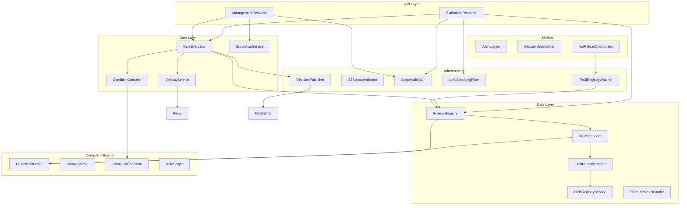
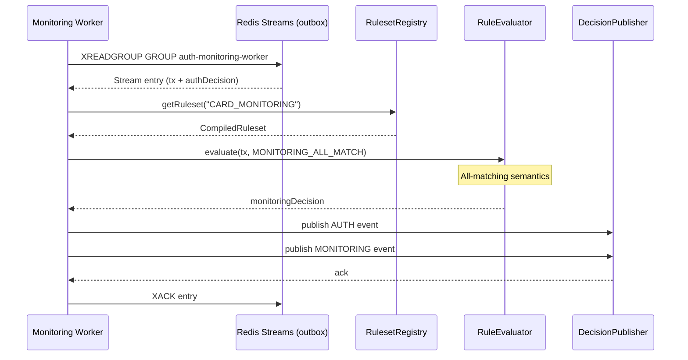
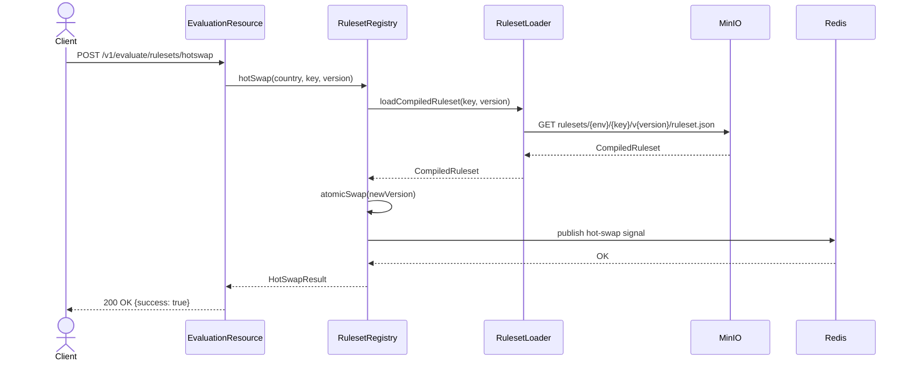
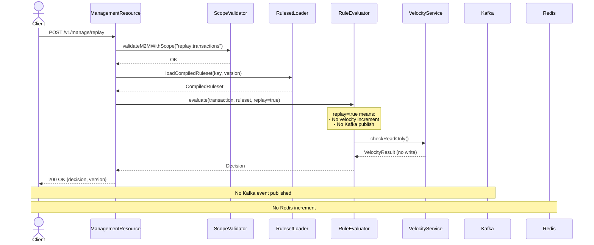

# Card Fraud Rule Engine - Architecture

This document describes the system architecture, components, and data flow of the Card Fraud Rule Engine.

## System Context



### External Actors

| Actor | Description | Interactions |
|-------|-------------|--------------|
| **Transaction Processing** | Core payment system | Calls AUTH/MONITORING for fraud evaluation |
| **Admin UI / Portal** | Web interface for fraud analysts | Calls replay, simulation, metrics endpoints |
| **Transaction Management** | Decision event consumer | Reads decision events from Kafka |

### External Dependencies

| Service | Purpose | Protocol |
|---------|---------|----------|
| **Redis 8.4** | Velocity state, hot reload signals | TCP |
| **Redpanda** | Kafka-compatible event streaming | Kafka Protocol |
| **MinIO** | S3-compatible ruleset artifact storage | S3 API |
| **Doppler** | Secrets management | CLI |

## Container Diagram

```mermaid
graph TB
    subgraph "Docker Compose"
        Redis[Redis :6379]
        Redpanda[Redpanda :9092]
        MinIO[MinIO :9000]
    end

    subgraph "Application Host"
        Engine[Quarkus App :8081]
    end

    subgraph "External Services"
        Doppler[Doppler CLI]
    end

    Engine -->|Velocity| Redis
    Engine -->|Outbox (Streams)| Redis
    Worker -->|Consume Outbox| Redis
    Worker -->|Events| Redpanda
    Engine -->|Rulesets| MinIO
    Doppler -->|Inject Secrets| Engine
```

### Container Details

| Container | Ports | Volumes | Purpose |
|-----------|-------|---------|---------|
| **card-fraud-rule-engine** | 8081:HTTP | - | Quarkus application |
| **redis** | 6379:TCP | redis_data:/data | Velocity state |
| **redpanda** | 9092:Kafka, 9644:Admin | redpanda_data:/var/lib/redpanda | Event streaming |
| **minio** | 9000:HTTP, 9001:Console | minio_data:/data | Ruleset storage |

## Component Diagram



### Component Descriptions

| Component | Responsibility | File |
|-----------|----------------|------|
| **EvaluationResource** | REST endpoints for AUTH/MONITORING evaluation | `resource/EvaluationResource.java` |
| **ManagementResource** | REST endpoints for replay, simulation, metrics | `resource/ManagementResource.java` |
| **RuleEvaluator** | Core rule evaluation logic (first-match AUTH, all-match MONITORING) | `engine/RuleEvaluator.java` |
| **ConditionCompiler** | Compiles Condition objects to lambda functions | `engine/ConditionCompiler.java` |
| **VelocityService** | Atomic Redis velocity checking with Lua scripts | `velocity/VelocityService.java` |
| **SimulationService** | Ad-hoc ruleset testing without side effects | `simulation/SimulationService.java` |
| **RulesetRegistry** | In-memory ruleset cache with atomic hot-swap | `ruleset/RulesetRegistry.java` |
| **RulesetLoader** | Load compiled rulesets from MinIO/S3 | `ruleset/RulesetLoader.java` |
| **FieldRegistryService** | Field name to ID mapping and lookup | `service/FieldRegistryService.java` |
| **FieldRegistryLoader** | Load field registry from S3 with checksum validation | `loader/FieldRegistryLoader.java` |
| **StartupRulesetLoader** | Bulk-load rulesets at application startup | `startup/StartupRulesetLoader.java` |
| **DecisionPublisher** | Kafka event publishing to Redpanda (invoked by worker and direct MONITORING endpoint) | `kafka/DecisionPublisher.java` |
| **DecisionEventCreate** | Kafka event schema (DecisionEventCreate) | `kafka/DecisionEventCreate.java` |
| **OutboxClient / OutboxFacade** | Redis Streams append/consume abstraction for auth-to-monitoring orchestration (ADR-0014) | `outbox/OutboxClient.java`, `outbox/OutboxFacade.java` |
| **MonitoringOutboxWorker** | Consumes outbox, runs MONITORING_ALL_MATCH, then publishes AUTH and MONITORING events to Kafka (ADR-0014) | `outbox/MonitoringOutboxWorker.java` |
| **LoadSheddingFilter** | HTTP filter for request rate limiting | `filter/LoadSheddingFilter.java` |
| **FieldRegistryWatcher** | Watch for field registry changes | `watcher/FieldRegistryWatcher.java` |
| **AlertLogger** | Structured alert logging for monitoring | `util/AlertLogger.java` |
| **DecisionNormalizer** | Normalize decision values (APPROVE/DECLINE) | `util/DecisionNormalizer.java` |
| **HotReloadCoordinator** | Coordinate hot-reload across instances | `service/HotReloadCoordinator.java` |
| **S3StartupValidator** | Validate S3 connectivity at startup | `startup/S3StartupValidator.java` |

### Compiled Objects (Performance Optimization)

| Class | Purpose | Performance Benefit |
|-------|---------|---------------------|
| **CompiledRuleset** | Pre-sorted rules with cached priority order | Eliminates per-request sorting |
| **CompiledRule** | Pre-validated rule with compiled conditions | Faster rule matching |
| **CompiledCondition** | Lambda-compiled condition evaluator | 40-50% faster condition evaluation |
| **RuleScope** | Pre-extracted velocity config from rule | Reduces object allocations |

## Domain Model

```mermaid
classDiagram
    class TransactionContext {
        +String transaction_id
        +String card_hash
        +double amount
        +String currency
        +String merchant_category_code
        +String country_code
        +String transaction_type
        +getField(int fieldId) Object
    }

    class Condition {
        +int fieldId
        +Operator operator
        +Object value
        +String stringValue
        +double numericValue
        +evaluate(TransactionContext) boolean
    }

    class Rule {
        +String rule_id
        +String name
        +List~Condition~ conditions
        +Decision action
        +String decision_reason
        +VelocityConfig velocity
        +evaluate(TransactionContext) MatchResult
    }

    class Ruleset {
        +String rulesetKey
        +String version
        +List~Rule~ rules
        +String evaluationMode
        +List~VelocityConfig~ velocities
        +evaluate(TransactionContext) MatchResult
    }

    class CompiledRuleset {
        +CompiledRule[] rulesByPriority
        +VelocityConfig[] velocityConfigs
        +evaluate(TransactionContext) MatchResult
    }

    class CompiledRule {
        +int priority
        +CompiledCondition[] conditions
        +Decision action
        +String decisionReason
        +VelocityConfig velocity
        +evaluate(TransactionContext) MatchResult
    }

    class CompiledCondition {
        +int fieldId
        +Operator operator
        +Object threshold
        +Function~TransactionContext, Boolean~ evaluator
        +evaluate(TransactionContext) boolean
    }

    class Decision {
        <<enumeration>>
        APPROVE
        DECLINE
        REVIEW
    }

    class VelocityConfig {
        +String keyPattern
        +int threshold
        +int windowSeconds
        +String operator
    }

    TransactionContext --> Decision
    Condition --> Operator
    Rule --> Condition
    Rule --> Decision
    Rule --> VelocityConfig
    Ruleset --> Rule
    CompiledRuleset --> CompiledRule
    CompiledRule --> CompiledCondition
    CompiledRule --> Decision
    CompiledRule --> VelocityConfig

## Sequence Diagrams

### AUTH Evaluation Flow

```mermaid
sequenceDiagram
    actor Client
    participant API as EvaluationResource
    participant Auth as ScopeValidator
    participant Registry as RulesetRegistry
    participant Evaluator as RuleEvaluator
    participant Velocity as VelocityService
    participant Redis as Redis Streams (outbox)

    Client->>API: POST /v1/evaluate/auth
    API->>Auth: validateM2MWithScope("execute:rules")
    Auth-->>API: OK

    API->>Registry: getRuleset("CARD_AUTH")
    Registry-->>API: CompiledRuleset

    API->>Evaluator: evaluate(tx, AUTH_FIRST_MATCH)
    Evaluator->>Velocity: checkVelocity(tx, ruleset)
    Velocity->>Redis: EVAL velocity_check_script
    Redis-->>Velocity: count, exceeded
    Velocity-->>Evaluator: VelocityResult

    Evaluator-->>API: Decision
    API->>Redis: XADD fraud:outbox * payload (tx + authDecision)
    API-->>Client: 200 OK {decision: "APPROVE"}
```

### Monitoring Worker Flow



### Hot Swap Flow



### Replay Flow (No Side Effects)



## Data Flow Summary

| Flow | Description | Side Effects |
|------|-------------|--------------|
| **AUTH** | Real-time fraud evaluation (first-match, fail-open) | Redis velocity increment, Redis Streams outbox enqueue (ADR-0014) |
| **MONITORING** | Analytics tracking (all-match, worker-driven) | Kafka event after MONITORING evaluation (worker) |
| **Hot Swap** | Update ruleset version atomically | Redis pub/sub signal |
| **Replay** | Test with no side effects | None |
| **Simulation** | Ad-hoc ruleset testing | None |

## Compiled Ruleset Format

The engine uses pre-compiled rulesets for optimal performance:

```json
{
  "rulesetKey": "CARD_AUTH",
  "version": "v3",
  "rules": [
    {
      "ruleId": "RULE_001",
      "name": "High-Risk MCC",
      "priority": 1,
      "conditions": [
        {
          "fieldId": 3,
          "operator": "IN",
          "value": ["7995", "5967", "7801"]
        },
        {
          "fieldId": 2,
          "operator": "GT",
          "value": 100.00
        }
      ],
      "action": "DECLINE",
      "decisionReason": "HIGH_RISK_MCC_AMOUNT",
      "velocity": null
    }
  ],
  "evaluationMode": "FIRST_MATCH",
  "velocities": [
    {
      "keyPattern": "card:{card_hash}:txn:{window}",
      "threshold": 10,
      "windowSeconds": 3600,
      "operator": "GTE"
    }
  ]
}
```

### Key Differences: YAML vs Compiled JSON

| Aspect | YAML (Development) | JSON (Production) |
|--------|-------------------|-------------------|
| **Format** | Human-readable | Optimized binary |
| **Sorting** | Runtime | Load-time |
| **Conditions** | Interpretive | Lambda-compiled |
| **Performance** | Baseline | 40-50% faster |

## Related Documentation

| Layer | Technology |
|-------|------------|
| **Runtime** | Java 21 (Temurin) |
| **Framework** | Quarkus 3.8.1 |
| **Build** | Maven 3.9+ |
| **REST** | Jakarta REST (formerly JAX-RS) |
| **JSON** | Jackson |
| **Redis** | Quarkus Redis Client (Redis 8.4) |
| **Kafka** | MicroProfile Reactive Messaging (Redpanda) |
| **S3/MinIO** | AWS SDK for Java v2 |
| **OpenAPI** | SmallRye OpenAPI |
| **Testing** | JUnit 5, AssertJ, RestAssured, Mockito |
| **Benchmarking** | JMH (Java Microbenchmark Harness) |

## Performance Characteristics

| Metric | Value | Notes |
|--------|-------|-------|
| **P50 Latency** | ~5ms | Simple AUTH evaluation |
| **P95 Latency** | ~7ms | With velocity checks |
| **P99 Latency** | ~10ms | Complex rulesets |
| **Throughput** | 10,000 TPS | Sustained with connection pooling |
| **Line Coverage** | 86% | Jacoco |
| **Test Count** | 578 | All passing |

### Performance Optimizations Applied

1. **Compiled Rules** - Rules sorted at load time, not per-request
2. **Lambda Conditions** - Pre-compiled condition evaluators (40-50% faster)
3. **Array-Based Fields** - Object[] instead of HashMap lookups
4. **For-Loop over Stream** - Eliminated stream allocations
5. **Async Velocity Snapshot** - Removed Redis round-trips from hot path
6. **Pre-compiled Regex** - Velocity key patterns compiled once

## Code Statistics

| Category | Count | Description |
|----------|-------|-------------|
| **Total Java Files** | 68 | All source files |
| **Domain Models** | 11 | Core business objects |
| **Compiled Objects** | 4 | Performance-optimized versions |
| **REST Resources** | 2 | API endpoints |
| **DTOs** | 18 | Request/response objects |
| **Services** | 3 | Business logic |
| **Loaders** | 2 | Data loading |
| **Infrastructure** | 6 | Kafka, Redis, Auth, filters |
| **Utilities** | 2 | Alert logging, decision normalization |

### File Structure

```
src/main/java/com/fraud/engine/
├── FraudRuleEngineApplication.java      # Quarkus application entry
├── config/
│   └── EvaluationConfig.java            # Debug mode configuration
├── domain/
│   ├── Condition.java                   # Rule condition (field + operator + value)
│   ├── Decision.java                    # Decision enum (APPROVE/DECLINE/REVIEW)
│   ├── DebugInfo.java                   # Debug information for conditions
│   ├── EngineMetadata.java              # Engine version/metadata
│   ├── FieldRegistry.java               # Field ID to name mapping
│   ├── Rule.java                        # Rule (conditions + action)
│   ├── Ruleset.java                     # Ruleset (rules + metadata)
│   ├── TimingBreakdown.java             # Performance timing data
│   ├── TransactionContext.java          # Transaction data wrapper
│   └── VelocityConfig.java              # Velocity counter configuration
├── domain/compiled/                     # Performance-optimized objects
│   ├── CompiledCondition.java           # Lambda-compiled condition
│   ├── CompiledRule.java                # Pre-validated rule
│   ├── CompiledRuleset.java             # Pre-sorted ruleset
│   └── RuleScope.java                   # Pre-extracted velocity config
├── dto/                                 # Data Transfer Objects
│   ├── FieldRegistryArtifact.java
│   ├── FieldRegistryEntry.java
│   ├── FieldRegistryManifest.java
│   └── RulesetManifest.java
├── engine/
│   ├── ConditionCompiler.java           # Compiles conditions to lambdas
│   └── RuleEvaluator.java               # Core evaluation logic
├── filter/
│   └── LoadSheddingFilter.java          # Rate limiting filter
├── kafka/
│   ├── DecisionEventCreate.java         # Kafka event schema
│   └── DecisionPublisher.java           # Async Kafka publisher
├── loader/
│   └── FieldRegistryLoader.java         # Loads field registry from S3
├── resource/
│   ├── EvaluationResource.java          # AUTH/MONITORING endpoints
│   ├── ManagementResource.java          # Replay/simulation endpoints
│   └── dto/                             # API request/response DTOs
├── ruleset/
│   ├── RulesetLoader.java               # Loads rulesets from S3
│   └── RulesetRegistry.java             # In-memory cache with hot-swap
├── security/
├── service/
│   ├── FieldRegistryService.java        # Field lookup service
│   └── HotReloadCoordinator.java        # Coordinates hot-reload
├── simulation/
│   └── SimulationService.java           # Ad-hoc ruleset testing
├── startup/
│   ├── S3StartupValidator.java          # Validates S3 at startup
│   └── StartupRulesetLoader.java        # Bulk-loads rulesets
├── util/
│   ├── AlertLogger.java                 # Structured alert logging
│   └── DecisionNormalizer.java          # Decision normalization
└── watcher/
    └── FieldRegistryWatcher.java        # Watches for field registry changes
```

## Related Documentation

- [Technical Design](../02-development/README.md)
- [API Examples](../03-api/README.md)
- [ADR-0002: Fail-Open Semantics](../07-reference/0002-auth-fail-open-default-approve.md)
- [ADR-0008: S3 Manifest Only](../07-reference/0008-runtime-reads-s3-manifest-only.md)
